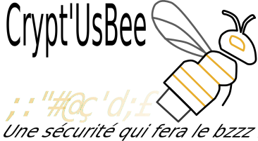

# Crypt'Us Bee
## Stack Technique

Le projet utilise les technologies suivantes :

- 
- 
- 
- 
- 
- 
- 
- 
- 
- 

## Titre

Crypt'Us Bee

## Description
Projet d'outil de sécurité (interface à distance + poste local + cryptage de données). L'adminstrateur de l'organisation pourra sur une interface conteneurisée et kubernetisée, créer des tocken sur des clés USB [biométrique] ou non et enregistrer les éléments dans une base de données sécurisée.

L'utilisateur aura besoin du Token pour se connecter sur son poste enrôlé ou sur l'Intranet de l'organisation ou encore pour décoder les fichiers cryptés.

Le projet repose sur un triple niveau de sécurité :
 - Ce que **je sais** (mot de passe)
 - Ce que **j'ai** (token)
 - [Ce que **je suis** (biométrie)]

## Installation
### Prérequis

-[ ] Kubernetes (K8S)
-[ ] Docker
-[ ] Make (Windows)
    -[ ] Lancement du fichier Make
-[ ] Bash (Linux/MacOs)
    -[ ] Lancement du script d'installation

## Utilisation
### Interface

L'interface est divisée en deux types d'accès : administrateur et utilisateur.

#### Accès Utilisateur
L'utilisateur peut gérer ses propres usages, notamment :
- Gestion des tokens personnels.
- Gestion des postes associés.
- Gestion des fichiers et dossiers cryptés.

#### Accès Administrateur
L'administrateur dispose de droits étendus pour gérer l'ensemble des usages, incluant :
- Gestion des tokens de tous les utilisateurs.
- Gestion des postes associés à tous les utilisateurs.
- Révocation des tokens, postes et accès des utilisateurs.
- Supervision globale des activités liées au cryptage et à la sécurité.

## Contributions

Indications de contributions au projet et soumission d'amélioration
