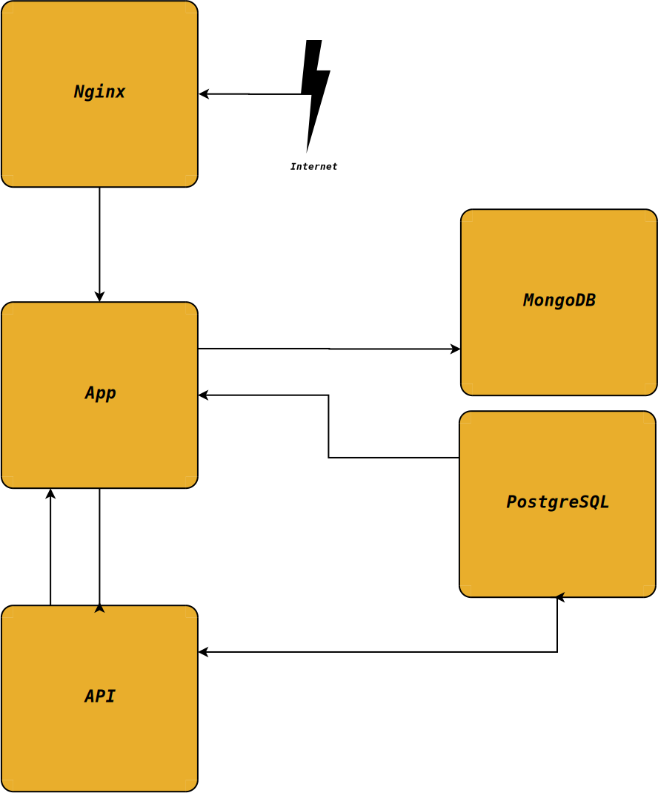

# Crypt'Us Bee

## Le marché actuel

Le marché de la sécurité informatique est en pleine expansion, avec une demande croissante pour des solutions d'authentification robustes et faciles à utiliser. Les entreprises cherchent à protéger leurs données sensibles tout en offrant une expérience utilisateur fluide et d'une grande simplicité. Les clés USB sécurisées, en tant que moyen d'authentification, gagnent en popularité en raison de leur efficacité.

[🔗 Page de comparaison](./documentation/first_doc.md)

## 🚀 Stack Technique

### 🧠 Back-end

- 
- 
- 
- 
- 
- 

### 🎨 Front-end

- 
- 
- 
- 

### ⚙️ DevOps & Outils

- 
- 
- 
- 

### Conteneurisation

## Titre

## Description

Projet d'outil de sécurité (interface à distance + poste local + cryptage de données). L'adminstrateur de l'organisation pourra sur une interface conteneurisée et kubernetisée, créer des tocken sur des clés USB [optional biométrique] et enregistrer les éléments dans une base de données noSQL.

La base de données SQL permettra de stocker des données de validation, comme une clé de cryptage des éléments dans mongoDB, propre à l'utilisateur, la clé de cryptage de données propre à l'organisation.

L'utilisateur aura besoin du Token pour se connecter sur son poste enrôlé ou sur l'Intranet de l'organisation ou encore pour décoder les fichiers cryptés.

Le projet repose sur un triple niveau de sécurité :

- Ce que **je sais** (mot de passe)
- Ce que **j'ai** (token)
- [Ce que **je suis** (biométrie)]

## Installation

### Prérequis

- [ ] Kubernetes (K8S-K3S)
- [ ] Docker
- [ ] Make (Windows)
  - [ ] Lancement du fichier Make
- [ ] Bash (Linux/MacOs)
  - [ ] Lancement du script d'installation

## Utilisation

### Interface

L'interface est divisée en deux types d'accès : administrateurs et utilisateurs.

#### Accès Utilisateur

L'utilisateur peut gérer ses propres usages, notamment :

- Gestion (de la)/(des) tokens personnels.
- Gestion du/des postes associés.
- Gestion des fichiers et dossiers cryptés.

#### Accès Administrateur

L'administrateur dispose de droits étendus pour gérer l'ensemble des usages, incluant :

- Gestion des tokens de tous les utilisateurs.
- Gestion des postes associés à tous les utilisateurs.
- Révocation des tokens, postes et accès des utilisateurs.
- Supervision globale des activités liées au cryptage et à la sécurité.

## Contributions

Le projet actuel est toujours en cours de développement (**dev** ~~stage~~ ~~prod~~)
Nous recherchons des contributeurs pour développer le projet. Dans le cadre de ce projet, vous pouvez :

- Participer à l'élaboration du projet lui-même.
- Proposer des améliorations ou de nouvelles fonctionnalités.
- Signaler des bugs ou des problèmes de sécurité.
- Participer à la documentation et à la rédaction de guides d'utilisation.
- Tester le projet et fournir des retours d'expérience.
